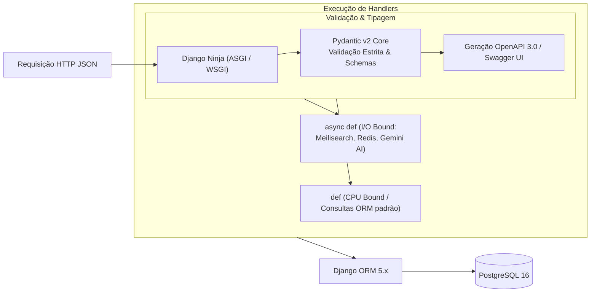

# Backend & Django Ninja: O Melhor de Dois Mundos

O ecossistema **UnBook 2.0** adota o **Django Ninja** como o framework central de desenvolvimento de suas APIs de backend. Esta decisão arquitetural consolida a união estratégica entre a robustez operacional do ecossistema **Django** e a experiência moderna de desenvolvimento (*Developer Experience - DX*) e performance do **FastAPI**.

---

## 1. Contexto & Motivação

Durante o planejamento inicial do UnBook 2.0, identificou-se um dilema clássico na escolha do framework de backend em Python:

* **Abordagem com Microframework (FastAPI puro):**  
  Proporciona excelente validação com Pydantic v2, documentação OpenAPI automática e suporte nativo a rotas assíncronas (`asyncio`). Contudo, exige que a equipe construa e mantenha manualmente do zero: conexão e pool de banco (SQLAlchemy), sistema de migrações complexo (Alembic), autenticação/sessões e, crucialmente, um **painel administrativo** para moderação de dados acadêmicos e avaliações de estudantes.
* **Abordagem Tradicional com Django REST Framework (DRF):**  
  Traz toda a solidez do Django ("*batteries included*"), incluindo o lendário Django ORM, migrações automatizadas e o Django Admin. No entanto, o DRF sofre com serializadores verbosos (`serializers.ModelSerializer`), validação legada, performance de serialização inferior e complexidade para trabalhar com tipagem moderna e rotas assíncronas ASGI.

**A Solução com Django Ninja:**  
O **Django Ninja** soluciona esse dilema entregando uma camada de APIs REST sobre o Django inspirada diretamente na ergonomia do FastAPI. Ele viabiliza o uso simultâneo do poder estrutural do Django com schemas Pydantic v2, anotações de tipo padrão do Python e endpoints assíncronos de alta performance.

---

## 2. Comparativo Arquitetural

| Dimensão Técnica | FastAPI Puro | Django REST Framework (DRF) | Django + Django Ninja |
| :--- | :--- | :--- | :--- |
| **ORM & Modelagem** | Externo (SQLAlchemy / SQLModel) | Nativo (Django ORM) | **Nativo (Django ORM)** |
| **Sistema de Migrações** | Manual via Alembic | Nativo (`makemigrations`/`migrate`) | **Nativo (`makemigrations`/`migrate`)** |
| **Painel Administrativo** | Inexistente (requer frontend próprio) | Nativo (Django Admin) | **Nativo (Django Admin pronto no Dia 1)** |
| **Validação de Schemas** | Pydantic v2 | Serializers legados do DRF | **Pydantic v2 nativo** |
| **Tipagem (Type Hints)** | Nativa Python 3.10+ | Suporte parcial / gambiarras | **Nativa Python 3.10+** |
| **Documentação da API** | Automática (Swagger / OpenAPI 3) | Requer `drf-spectacular` ou similar | **Automática (Swagger / ReDoc nativo)** |
| **Suporte Assíncrono (ASGI)**| Nativo (`async def`) | Complexo / Parcial | **Nativo (`async def` e `def` síncrono)** |
| **Performance de Serialização**| Altíssima (Pydantic Core em Rust) | Média / Baixa | **Altíssima (Pydantic Core em Rust)** |
| **Curva de Aprendizado (UnB)**| Média (fragmentação de bibliotecas) | Alta (boilerplate e mágicas de DRF) | **Baixa/Acelerada (Django + Pydantic claro)** |

---

## 3. O Melhor do Django para o UnBook 2.0

### A. Django ORM & Migrações Sem Fricção
O UnBook 2.0 possui relacionamentos acadêmicos complexos:
- Campi, Institutos, Departamentos e Docentes (com matrículas SIAPE e gabinetes);
- Disciplinas e sua complexa árvore de dependências (`TB_RELACAO_MATERIA`), incluindo pré-requisitos, co-requisitos e equivalências inter-campi;
- Turmas ofertadas com códigos brutos do SIGAA (`24M12`), salas de aula e histórico semestral;
- Carteiras anônimas (`student_wallets`) e transações de tokens para prevenir avaliações fraudulentas.

O **Django ORM** gerencia essas estruturas de dados relacionais com migrações declarativas, reversíveis e determinísticas, eliminando o atrito comum em configurações de SQLAlchemy/Alembic.

### B. Django Admin: Moderação Imediata
O UnBook lida com dados sensíveis e conteúdo gerado pela comunidade discente da UnB. O **Django Admin** disponibiliza imediatamente:
1. **Moderação de Avaliações Anônimas:** Visualização rápida de denúncias de ofensas pessoais ou violações de conduta, permitindo suspensão de comentários com um clique.
2. **Correção de Inconsistências do SIGAA:** Ajuste manual emergencial caso um professor tenha mudado de departamento ou uma turma tenha sofrido retificação de horário no sistema da UnB.
3. **Gestão do Cardápio do RU:** Edição e homologação do cardápio semanal e preços do Restaurante Universitário sem exigir scripts diretos no banco de produção.

### C. Segurança Consolidada
O core do Django traz proteções automáticas e maduras contra SQL Injection, Clickjacking, Cross-Site Scripting (XSS) e Cross-Site Request Forgery (CSRF), além de um sistema granulado de grupos e permissões (`auth.models`).

---

## 4. O Melhor do FastAPI no Django Ninja



### A. Validação Estrita com Pydantic v2
Toda entrada e saída de dados é tipada por classes `ninja.Schema` (baseadas no Pydantic v2). Erros de validação (ex: formato de horário inválido no Planner ou nota fora da escala de 1 a 5) retornam respostas HTTP 422 padronizadas automaticamente.

### B. Documentação Swagger e ReDoc Automáticas
Ao rodar a aplicação, a documentação interativa completa é servida instantaneamente em `/api/docs`, permitindo que a equipe de frontend (`services/portal`) teste contratos e payloads sem depender de documentações manuais desatualizadas.

### C. Flexibilidade Síncrona e Assíncrona
Diferente de frameworks rígidos, o Django Ninja permite definir rotas assíncronas onde I/O é crítico e rotas síncronas onde a simplicidade impera:
- **Rotas `async def`:** Ideais para consultas ao **Meilisearch** (<15ms), chamadas à **Google Gemini API** (sumarização de ementas) e leitura no **Redis 7** (grades temporárias do Planner).
- **Rotas `def` tradicionais:** Executam no pool de threads padrão do Django, permitindo o uso convencional do Django ORM sem risco de concorrência.

---

## 5. Exemplo Prático de Implementação

Abaixo, um exemplo da arquitetura aplicada a um endpoint de busca e detalhamento de disciplinas no `services/catalog`:

```python
# services/catalog/api.py
from typing import List
from uuid import UUID
from ninja import NinjaAPI, Router, Schema
from django.shortcuts import aget_object_or_404
from .models import Course, Relation

# Instância da API com documentação OpenAPI integrada
api = NinjaAPI(
    title="UnBook 2.0 - Catalog API",
    version="2.0.0",
    description="Endpoints de catálogo acadêmico, ementas e dependências curriculares da UnB"
)

router = Router()

# 1. Schemas Pydantic para validação e serialização
class RelationOut(Schema):
    codigo_alvo: str
    nome_alvo: str
    tipo: str  # pre_requisito, co_requisito, equivalencia

class CourseDetailOut(Schema):
    id: UUID
    codigo: str
    nome: str
    ementa: str
    horas: int
    creditos: int
    relacoes: List[RelationOut] = []

# 2. Endpoint Assíncrono de alta performance
@router.get("/courses/{codigo}", response=CourseDetailOut)
async def get_course_detail(request, codigo: str):
    """
    Recupera os detalhes de uma disciplina e seu grafo de dependências.
    Executa de forma assíncrona usando o Django 5 async ORM.
    """
    course = await aget_object_or_404(
        Course.objects.prefetch_related("relacoes_origem__disciplina_destino"),
        codigo=codigo.upper()
    )
    
    # Montagem da resposta estruturada tipada
    relacoes_data = [
        RelationOut(
            codigo_alvo=rel.disciplina_destino.codigo,
            nome_alvo=rel.disciplina_destino.nome,
            tipo=rel.tipo_relacao
        )
        async for rel in course.relacoes_origem.all()
    ]
    
    return CourseDetailOut(
        id=course.id,
        codigo=course.codigo,
        nome=course.nome,
        ementa=course.ementa,
        horas=course.carga_horaria,
        creditos=course.carga_horaria // 15,
        relacoes=relacoes_data
    )

api.add_router("/catalog", router)
```

---

## 6. Boas Práticas & Diretrizes de Engenharia

Para evitar armadilhas comuns na união de Django com operações assíncronas:

1. **Evite `SynchronousOnlyOperation` em rotas `async def`:**  
   Ao utilizar `async def`, utilize os métodos nativos assíncronos do Django ORM (`.afirst()`, `.aget()`, `.acount()`, `async for`) ou envolva blocos relacionais síncronos com `sync_to_async` do `asgiref`.
2. **Utilize `select_related` e `prefetch_related`:**  
   Sempre realize o carregamento antecipado de chaves estrangeiras e relacionamentos muitos-para-muitos para mitigar o problema de consultas *N+1* e garantir que as instâncias estejam preenchidas antes da serialização no Pydantic.
3. **Moderar no Django Admin, Consumir no Django Ninja:**  
   Regra de ouro das squads: o Django Admin é a central interna de governança e curadoria de dados da UnB; as interfaces de usuário finais (PWA Next.js) consomem exclusivamente as rotas versionadas do Django Ninja.
4. **Testabilidade:**  
   Utilize o cliente de testes `TestClient(api)` nativo do Django Ninja em conjunto com o `pytest-django` para validar contratos de requisição e resposta com cobertura contínua de CI.

---

## 7. Benefício para as Squads e Comunidade da UnB

Na Universidade de Brasília, estudantes dos cursos de Engenharia de Software e Ciência da Computação frequentemente aprendem Django em disciplinas como Métodos de Desenvolvimento de Software (MDS) e Engenharia de Produto de Software (EPS). 

A adoção do **Django Ninja** equilibra com precisão:
- **Acessibilidade Pedagógica:** Aproveita o conhecimento prévio da comunidade acadêmica no ecossistema Django;
- **Modernidade Tecnológica:** Capacita os contribuidores nos conceitos mais avançados de tipagem estrita com Pydantic v2, APIs reativas assíncronas e arquitetura orientada a microsserviços modulares.
