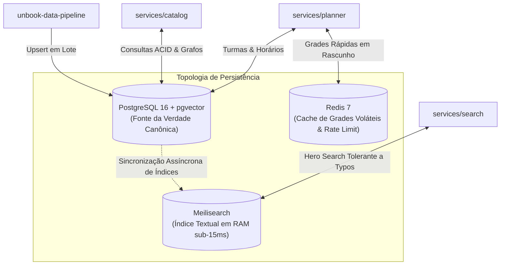
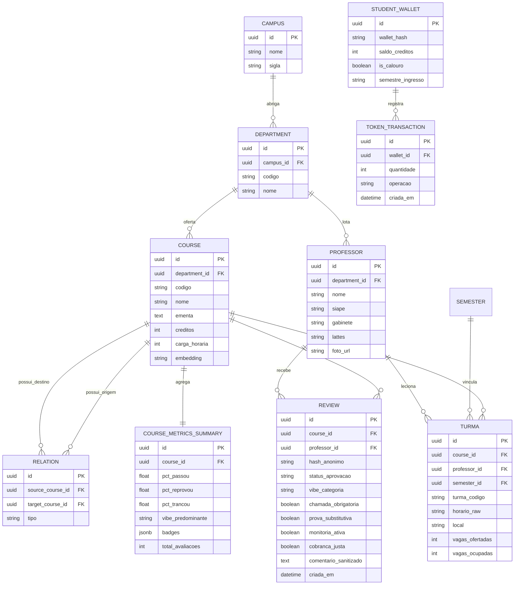

# Multi-Banco, Cache & pgvector

O ecossistema **UnBook 2.0** adota uma arquitetura de dados híbrida e poliglota, combinando a confiabilidade transacional ACID do **PostgreSQL 16**, o poder vetorial da extensão **`pgvector`**, a velocidade in-memory do **Redis 7** e a latência sub-15ms do **Meilisearch**.

---

## Divisão das Tecnologias de Dados

| Componente | Mecanismo | Papel & Casos de Uso |
| :--- | :--- | :--- |
| **PostgreSQL 16** | Relacional ACID + JSONB | Catálogo canônico de cursos, turmas do SIGAA, docentes, histórico de semestres e avaliações anônimas. |
| **`pgvector`** | Extensão Vetorial | Armazenamento de embeddings textuais de ementas e recomendações semânticas de matérias optativas. |
| **Meilisearch** | Motor de Busca Full-Text | Indexação de termos com prefix matching instantâneo, correção de typos e busca por apelidos (*"C1"*, *"FSO"*). |
| **Redis 7** | Armazenamento Chave-Valor em Memória | Cache volátil de grades temporárias do simulador de grade (*Planner*), rate-limiting e sessões de API. |

---

## Domínios de Dados no PostgreSQL

O banco relacional central é segmentado em três grandes domínios de negócio:

---

## Detalhamento dos Domínios de Dados

### 1. Núcleo Acadêmico (Estrutura UnB)
- **`campuses`:** Os quatro campi oficiais da Universidade de Brasília: Darcy Ribeiro (Plano Piloto), FGA (Gama), FCE (Ceilândia) e FAL (Planaltina).
- **`departments`:** Institutos e Departamentos acadêmicos (ex: CIC, MAT, IFD, IQ, ENE).
- **`courses`:** Disciplinas catalogadas no SIGAA contendo código oficial, nome completo, ementa textual, carga horária e representação vetorial via `pgvector`.
- **`professors`:** Docentes da UnB com identificação institucional (SIAPE), localização do gabinete de atendimento, link do currículo Lattes e foto oficial minerada do SIGAA.
- **`relations` (`TB_RELACAO_MATERIA`):** Tabela pivot que implementa a estrutura em grafo de dependências das matérias:
  - `pre_requisito`: Disciplinas que devem ser concluídas obrigatoriamente antes da matrícula.
  - `co_requisito`: Disciplinas que devem ser cursadas simultaneamente no mesmo semestre.
  - `equivalencia`: Matérias de códigos distintos com conteúdo programático equivalente entre cursos.
- **`classes` & `semesters`:** Ofertas reais de turmas por período letivo (ex: `2026.1`), mantendo o código de horário bruto original do SIGAA (`24M12`).

---

### 2. Avaliação Express (Wizard) & Métricas
O modelo do UnBook 2.0 prioriza a facilidade e rapidez de preenchimento pelo estudante:
- **Status de Desfecho:** Seleção direta entre `Passei`, `Reprovei` ou `Tranquei`.
- **Categorias de Vibe / Sentimento:** Classificação afetiva imediata da matéria:
  - *Sono* — Conteúdo monótono ou excessivamente teórico;
  - *Explosão Mental* — Carga conceitual densa e complexa;
  - *Tranquilo* — Condução acessível e ritmo bem equilibrado;
  - *Revolta* — Provas desconexas do que foi ensinado em sala;
  - *Desafiador* — Exigência alta acompanhada de boa didática.
- **Toggles Booleanos Objetivos:**
  - `chamada_obrigatoria`: O professor cobra presença rigorosamente?
  - `prova_substitutiva`: Há oportunidade de prova substitutiva ou reposição de nota?
  - `monitoria_ativa`: Os monitores prestam suporte consistente?
  - `cobranca_justa`: O nível de dificuldade das provas é coerente com as aulas?
- **`course_metrics_summary`:** Tabela de agregação pré-computada que consolida percentuais de aprovação e badges automáticos (ex: `"PADGE: SONO"`, `"PADGE: PAU PURO"`), viabilizando consultas instantâneas no portal.

---

### 3. Gamificação & Economia de Créditos
Para incentivar a colaboração contínua preservando o anonimato:
- **Detecção Automática de Calouro:** Comparação entre o semestre de ingresso do estudante e o semestre letivo corrente da UnB.
- **Pacote de Boas-Vindas:** Atribuição inicial de tokens e simulações gratuitas de grade no Planner para novos ingressantes.
- **Carteira Privada (`student_wallets`):** Desvinculada de qualquer dado pessoal público; utiliza chaves de carteira anônimas e registra extrato auditável de créditos via `token_transactions`.
