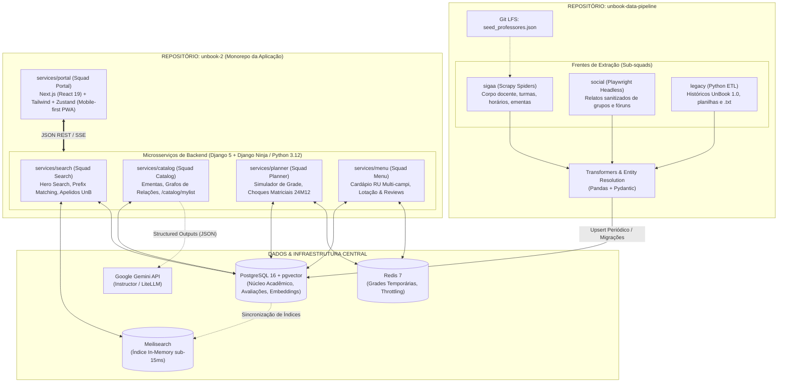

# Visão Geral da Arquitetura

O **UnBook 2.0** é estruturado em uma topologia moderna que separa claramente a **esteira contínua de extração de dados brutos** da **aplicação monorepo orientada a microsserviços modulares**.

Essa separação garante que mudanças nos portais institucionais da UnB (SIGAA) ou atualizações nas esteiras de scraping não afetem a disponibilidade dos serviços de consulta consumidos pelos estudantes.

---

## Topologia dos Repositórios

O ecossistema é mantido em dois repositórios complementares:



---

## Divisão das Camadas

### 1. Repositório de Ingestão (`unbook-data-pipeline`)
* **Propósito:** Coletar, decodificar, higienizar e estruturar os dados acadêmicos dispersos pela UnB.
* **Operação:** Executa em lote (*batch jobs*) ou acionado sob demanda por eventos de atualização do calendário acadêmico da UnB.
* **Isolamento:** Não atende diretamente requisições de usuários finais; comunica-se com a aplicação central via upserts idempotentes no PostgreSQL ou exportação de dumps estruturados.
* **Frentes Especializadas:**
  - **`sigaa`:** Rastreadores assíncronos que navegam nas estruturas do SIGAA para catalogar docentes, ementas oficiais e a grade semestral de turmas.
  - **`social`:** Esteira automatizada com Playwright para captura de relatos comunitários (Facebook DOM dumps, grupos de discussão acadêmica), submetendo-os a filtros severos de anonimização.
  - **`legacy`:** Parser dedicado a migrar dados históricos e formulários legados da versão 1.0 do UnBook.

### 2. Repositório Principal da Aplicação (`unbook-2`)
Adota o padrão de monorepo estruturado da seguinte forma:

```text
unbook-2/
├── docs/                     # Documentação Material for MkDocs (Docs-as-Code)
├── mkdocs.yml                # Configuração do MkDocs
├── packages/                 # Pacotes e utilitários compartilhados
│   ├── ui/                   # Design system e componentes visuais React
│   └── ts-types/             # Tipagens TypeScript compartilhadas
└── services/                 # Microsserviços modulares
    ├── portal/               # Next.js 19 + Tailwind + Zustand (Frontend PWA)
    ├── search/               # Django Ninja + Meilisearch (Motor de Busca Rápida)
    ├── catalog/              # Django Ninja + Django ORM (Ementas, Grafos e Análise UnBook)
    ├── planner/              # Django Ninja + Validador Matricial (Grade Horária)
    └── menu/                 # Django Ninja + PostgreSQL/Redis (Cardápio RU, Filas & Reviews)
```

> [!NOTE] Padronização de Backend com Django Ninja
> A camada de serviços de backend unifica a solidez do Django (ORM, migrações e Django Admin para moderação de dados e relatos) com a agilidade, validação Pydantic v2 e documentação OpenAPI nativa inspirada no FastAPI via **Django Ninja**. Para detalhes da análise e especificações, consulte o documento [Backend & Django Ninja](backend.md).

---

## Fluxo de Comunicação & Interoperabilidade

1. **Busca Ultrarrápida (Hero Search):**
   - O estudante digita na barra global do `services/portal` (*"C1"*, *"Rispolli"*, *"FSO"*).
   - O frontend dispara requisição para o `services/search`.
   - O Meilisearch processa a consulta com prefix matching e sinônimos, devolvendo o resultado em **menos de 15ms**.
2. **Navegação Curricular & Análise UnBook:**
   - Ao selecionar uma disciplina, o portal consulta o `services/catalog`.
   - O serviço monta a árvore de pré-requisitos/equivalências (`TB_RELACAO_MATERIA`) e recupera a síntese da **Análise UnBook** gerada via **Google Gemini API** (com resumos de pontos fortes e badges dinâmicos).
3. **Montagem e Simulação da Grade Horária:**
   - O estudante adiciona turmas no `services/planner`.
   - O backend valida a matriz de conflitos em tempo real contra códigos de horário brutos (ex: `24M12` vs `35T34`).
   - O estado da simulação é mantido no **Redis 7** e sincronizado localmente com o **Zustand** no navegador, permitindo exportação instantânea para arquivos `.ics` e imagem compartilhável.
