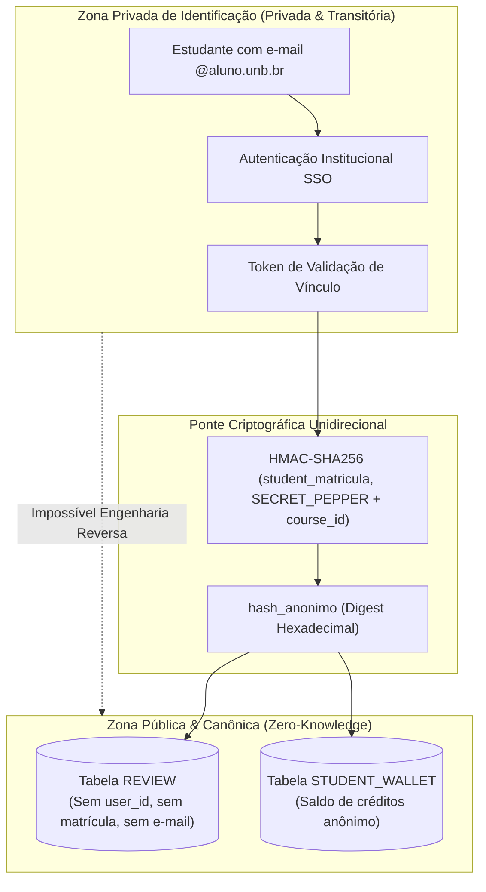
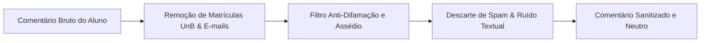

# Segurança & Anonimato Criptográfico

A integridade do **UnBook 2.0** apoia-se em um princípio fundamental: **nenhum estudante deve temer retaliação acadêmica ao emitir uma avaliação justa e didática**.

Para cumprir esse compromisso, o sistema implementa uma arquitetura de **Anonimato Criptográfico (*Zero-Knowledge Public*)**, separando de maneira irreversível a identidade verificada do aluno das avaliações e votos que ele publica.

---

## Princípio Zero-Knowledge Public

Ao contrário de fóruns convencionais ou redes sociais, o UnBook 2.0 não armazena nenhuma chave estrangeira conectando a conta do usuário às tabelas de avaliações:

### Como Funciona na Prática:
1. **Verificação de Legitimidade:** O aluno comprova vínculo universitário via e-mail `@aluno.unb.br` (garantindo que não é um bot externo ou usuário estranho à comunidade da UnB).
2. **Desvinculação do Identificador:** O backend da aplicação gera um identificador cego (`hash_anonimo`) utilizando a função `HMAC-SHA256`, combinando a matrícula com um salt secreto rotativo e o identificador do curso avaliado.
3. **Prevenção de Voto Duplo sem Identificação:** Caso o mesmo estudante tente submeter uma segunda avaliação para a mesma matéria, o hash gerado coincidirá, impedindo a fraude (`409 Conflict`), **sem que o banco precise saber quem é o aluno**.
4. **Isolamento Inter-Cursos:** O hash gerado para *Cálculo 1* (`MAT0025`) não possui correlação matemática com o hash gerado para *Algoritmos e Programação de Computadores* (`CIC0004`). É impossível traçar o perfil de navegação de um mesmo estudante entre disciplinas distintas.

---

## Carteira Privada de Tokens e Gamificação

Para manter a economia de créditos e os incentivos de participação sem violar o anonimato:

- Cada aluno recebe uma **Carteira Privada (`STUDENT_WALLET`)** indexada por um identificador criptográfico cego.
- Calouros (estudantes no primeiro semestre na UnB) recebem um bônus inicial de tokens para simulações completas no Planner.
- A concessão de créditos e as transações de uso são auditadas em `TOKEN_TRANSACTION`, sem conexão com a identidade acadêmica ou histórico pessoal.

---

## Higienização de Conteúdo & Expurgo de PII

Mesmo com avaliações orientadas a formulários rápidos (Wizard com categorias de sentimento e toggles booleanos), campos de texto livre de comentários passam por higienização estrita antes da gravação:

### Regras de Sanitização Ativas:
1. **Matrículas da UnB:** Detecção de padrões numéricos de 8 ou 9 dígitos comumente associados ao cadastro discente da UnB (`\b[12][0-9]{7,8}\b`), mascarados imediatamente para `[MATRÍCULA_REMOVIDA]`.
2. **Dados Pessoais (PII):** Expurgamento de CPFs, telefones celulares (DDD 61), redes sociais pessoais e e-mails de estudantes citados.
3. **Ataques de Caráter Pessoal:** Algoritmos de moderação textual bloqueiam termos de cunho discriminatório, injurioso ou alheio ao escopo pedagógico da disciplina.
4. **Descarte de Mensagens Inexpressivas (Junk):** Comentários com menos de 20 caracteres úteis ou formados por termos repetitivos (*"..."*, *"ok"*, *"teste"*, *"tr"*, *"nada a declarar"*) são descartados.

---

## Conformidade com a Lei Geral de Proteção de Dados (LGPD)

O UnBook 2.0 atende aos princípios basilares da Lei Federal nº 13.709/2018:

| Princípio LGPD | Implementação Técnica no UnBook 2.0 |
| :--- | :--- |
| **Minimização de Dados (Art. 6º, III)** | Armazena-se apenas o estritamente necessário para computar métricas pedagógicas; dados desnecessários não são sequer solicitados. |
| **Segurança & Prevenção (Art. 6º, VII e VIII)** | Hashes criptográficos unidirecionais, ausência de foreign keys entre usuários e avaliações, e tráfego 100% criptografado com TLS. |
| **Transparência & Livre Acesso (Art. 6º, II e IV)** | O código de todas as rotas e regras de anonimização é aberto e auditável no GitHub oficial da organização. |
| **Não Discriminação (Art. 6º, IX)** | É tecnicamente impossível utilizar a base do UnBook para segmentar ou discriminar alunos por preferências ou notas. |
