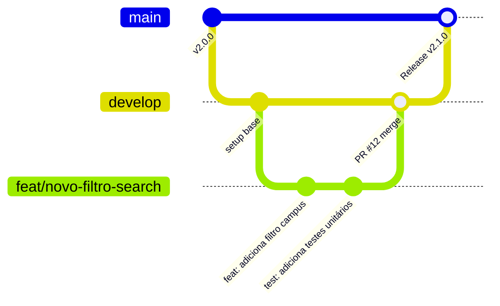

# Padrões de Engenharia, GitFlow & Squads

Para assegurar a qualidade, estabilidade e manutenibilidade do ecossistema **UnBook 2.0**, todos os contribuidores e mantenedores seguem as diretrizes de engenharia e governança aqui estabelecidas.

---

## Governança por Squads & CODEOWNERS

O desenvolvimento é descentralizado em squads autônomas que possuem responsabilidade técnica sobre seus respectivos módulos:

| Squad | Escopo no Monorepo / Repositórios | Responsabilidade |
| :--- | :--- | :--- |
| **`@unbook-org/squad-portal`** | `services/portal`, `packages/ui` | Experiência de usuário, Next.js, PWA e acessibilidade. |
| **`@unbook-org/squad-search`** | `services/search` | Motor Meilisearch, latência de busca e dicionário de sinônimos. |
| **`@unbook-org/squad-catalog`** | `services/catalog` | Modelagem curricular, grafos de matérias e integração com Gemini. |
| **`@unbook-org/squad-planner`** | `services/planner` | Algoritmo de choque de horários, grades semanais e exportação .ics. |
| **`@unbook-org/squad-menu`** | `services/menu` | Cardápio multi-campi do RU, avaliações gastronômicas, termômetro de filas e wikis. |
| **`@unbook-org/data-engineers`** | `unbook-data-pipeline` | Spiders SIGAA, automação social Playwright e higienização. |
| **`@unbook-org/core`** | `docs/`, `.github/`, `repository-template` | CI/CD, segurança da informação, arquitetura central e documentação. |

---

## Estratégia de Branches (GitFlow Adaptado)

Nenhum desenvolvedor possui permissão para efetuar commits diretamente nas branches protegidas `main` ou `develop`.



### Padrão de Nomenclatura de Branches:
- `feat/nome-da-feature` — Para desenvolvimento de novas funcionalidades;
- `fix/descricao-do-bug` — Para correção de defeitos em homologação ou produção;
- `docs/alteracao-doc` — Para melhorias ou adições na documentação MkDocs;
- `chore/tarefa-tecnica` — Para atualizações de dependências, refatorações internas ou CI/CD;
- `refactor/modulo-alvo` — Para reestruturação de código sem alteração no comportamento externo.

---

## Padrão de Commits (Conventional Commits)

Adotamos estritamente a especificação [Conventional Commits](https://www.conventionalcommits.org/):

```text
<tipo>[escopo opcional]: <descrição concisa no imperativo>

[corpo opcional explicando o motivo da mudança]

[rodapé opcional referenciando issues, ex: Closes #42]
```

### Exemplos Práticos no UnBook 2.0:
- `feat(search): implementa suporte a apelidos para turmas da FGA`
- `fix(planner): corrige cálculo de choque no horário 24M12`
- `perf(catalog): adiciona índice vetorial pgvector para busca semântica`
- `docs(mkdocs): documenta fluxo de anonimização Zero-Knowledge`
- `chore(deps): atualiza versão do Next.js para 19.x`

---

## Ciclo de Vida de um Pull Request (PR)

1. **Testes Locais:** Execute os linters e suítes de teste do módulo antes de abrir o PR:
   ```bash
   # No frontend:
   npm run lint && npm run build

   # Nos serviços Python:
   pytest && ruff check .
   ```
2. **Abertura do PR:** Direcione sempre para a branch `develop`.
3. **Template Obrigatório:** Preencha o template detalhando o propósito da alteração, checklist de validação e capturas de tela (quando aplicável ao frontend).
4. **Code Review:** Pelo menos **1 aprovação** de um membro da squad responsável pela pasta modificada (conforme regras do `CODEOWNERS`).
5. **CI Quality Check:** Todos os steps de validação automatizada do GitHub Actions devem passar com sucesso (`green`).
6. **Deploy de Documentação:** Ao mesclar alterações na pasta `docs/` ou no `mkdocs.yml` para a branch `main`, a action `.github/workflows/docs.yml` publica a nova versão no GitHub Pages automaticamente.
