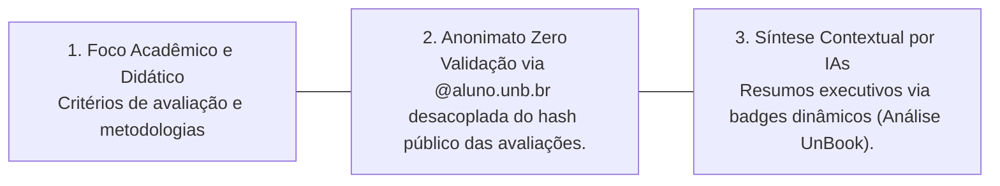
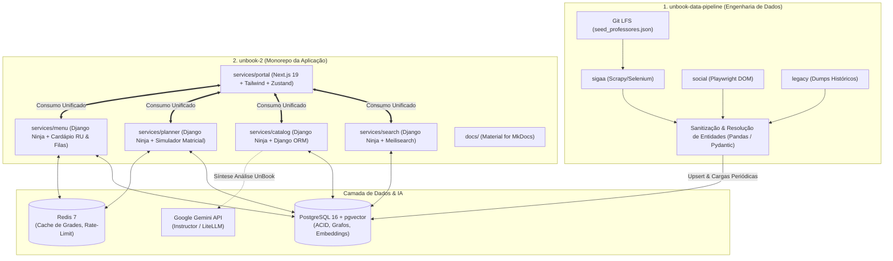

  

# UnBook 2.0 — Plataforma Acadêmica da UnB

**Documentação Técnica e Arquitetural Oficial**  
> O **UnBook 2.0** é a revitalização da plataforma comunitária voltada para os estudantes da **Universidade de Brasília (UnB)**. Transcendendo a antiga avaliação isolada de professores, o UnBook 2.0 consolida-se como um ecossistema integrado de **suporte à decisão de matrícula**, **transparência acadêmica**, **descoberta de conteúdo** e **planejamento semestral com preservação de anonimato**.

---

## Pilares e Princípios Fundamentais

O UnBook 2.0 foi desenhado sobre três diretrizes inegociáveis:

1. **Experiência Acadêmica e Não Pessoal:**  
   O foco absoluto das avaliações reside na didática docente, coerência e previsibilidade de provas, clareza dos critérios de correção e metodologias de ensino. Ataques pessoais e difamações são barrados preventivamente.
2. **Anonimato Criptográfico (*Zero-Knowledge Public*):**  
   Os estudantes autenticam-se com e-mail institucional `@aluno.unb.br` para garantir legitimidade e prevenir votos duplicados. Contudo, o `user_id` e os dados de perfil jamais são vinculados às avaliações públicas: emprega-se hash HMAC desvinculado e uma carteira privada de tokens.
3. **Síntese Contextual ("Análise UnBook"):**  
   Em vez de sobrecarregar o estudante com dezenas de comentários avulsos, a plataforma sintetiza os feedbacks históricos em relatórios executivos estruturados, destacando pontos fortes, pontos de atenção e badges dinâmicos gerados por LLM.

---

## Divisão em Repositórios do Ecossistema

O ecossistema é mantido e distribuído em **dois repositórios independentes**:

### A. Repositório de Ingestão (`unbook-data-pipeline`)
- **Foco:** Extração assíncrona, higienização, anonimização e resolução de entidades de professores, turmas e disciplinas da UnB.
- **Frentes / Sub-squads:** `sigaa` (Portal e Turmas), `social` (Mineração Playwright) e `legacy` (Processamento de bases antigas).
- **Dados Brutos:** Rastreamento via Git LFS do `seed_professores.json`.

### B. Repositório Principal de Aplicação (`unbook-2`)
- **Monorepo com microsserviços modulares:**
  - `services/portal`: Frontend Next.js (React 19) com Tailwind CSS e Zustand, interface *mobile-first* com suporte a PWA.
  - `services/search`: Motor de busca em tempo real com Django Ninja e Meilisearch, latência inferior a 15ms e tolerância a apelidos da UnB (*"C1"*, *"APC"*, *"Rispolli"*, *"FSO"*).
  - `services/catalog`: Guia curricular, ementas, árvores de pré/co-requisitos e equivalências (`TB_RELACAO_MATERIA`) e listas personalizadas (`/catalog/mylist`).
  - `services/planner`: Simulador interativo de grade horária semanal com validação de conflitos matriciais (ex: `24M12` vs `35T34`) e exportação para calendário (`.ics`).
  - `services/menu`: Gestão de cardápio do Restaurante Universitário (RU), avaliações de refeições, termômetro de filas e guias de acesso multi-campi.
  - `docs/`: Documentação técnica versionada no padrão *Docs-as-Code* publicada no GitHub Pages.

---

## Stack Tecnológica Consolidada

| Camada | Tecnologia Adotada | Justificativa Técnica |
| :--- | :--- | :--- |
| **Frontend Web** | Next.js (React 19) + Tailwind + Zustand | SSR otimizado para SEO em ementas/disciplinas e CSR ultra-rápido no montador de grade do Planner. |
| **Backend APIs** | Django 5 + Django Ninja (Python 3.12) | O melhor dos dois mundos: Django ORM, Admin e Migrações unidos à validação com Pydantic v2, rotas assíncronas e OpenAPI/Swagger nativos. |
| **Banco ACID** | PostgreSQL 16 + extensão `pgvector` | Dados canônicos, relacionamentos de pré-requisitos e busca vetorial para recomendações. |
| **Motor de Busca** | Meilisearch | Consultas instantâneas (<15ms), prefix matching e tolerância fonética a erros de digitação. |
| **Cache & Filas** | Redis 7 | Armazenamento volátil de grades temporárias do Planner, rate-limiting e mensageria leve. |
| **Inteligência / NLP** | Google Gemini API (via Instructor/LiteLLM) | Geração estruturada da **Análise UnBook**, síntese de tópicos e badges com *Structured Outputs* em JSON. |

---

## Mapa da Documentação

Para navegar com facilidade, utilize as seções organizadas no menu superior:

- [Visão Geral de Arquitetura](architecture/overview.md) — Topologia dos repositórios, fluxo de comunicação e contratos.
- [Backend & Django Ninja](architecture/backend.md) — Análise técnica, ORM, Django Admin, rotas assíncronas e Pydantic v2.
- [Multi-Banco, Cache & pgvector](architecture/database.md) — Modelagem relacional, tabelas centrais, Meilisearch e Redis.
- [Segurança & Anonimato Zero-Knowledge](architecture/security.md) — Mecanismo criptográfico de hashing HMAC e conformidade com a LGPD.
- [Portal Web (Next.js)](services/portal.md) — Shell frontend, experiência mobile-first e gerenciamento de estado.
- [Search Engine (Meilisearch)](services/search.md) — Mecanismo de busca, tolerância a typos e dicionário de apelidos da UnB.
- [Catálogo & Ementas](services/catalog.md) — Grafos de pré-requisitos, `/catalog/mylist` e síntese Análise UnBook via Gemini.
- [Planner de Grade Horária](services/planner.md) — Matriz de horários da UnB, detecção de choques e exportação .ics.
- [Menu do RU (Cardápio)](services/menu.md) — Cardápios dos campi da UnB, termômetro de filas, rankings e wikis do RU.
- [Pipeline de Ingestão](pipeline/integration.md) — Extração no SIGAA, Playwright social e Git LFS.
- [Contratos de Dados](pipeline/contracts.md) — Schemas Pydantic, normalização e resolução de entidades.
- [Setup Local com Docker](contributing/local-setup.md) — Passo a passo para subir o ecossistema com Docker Compose.
- [Padrões & Governança](contributing/standards.md) — Convenções de commits, branches, squads e templates.
