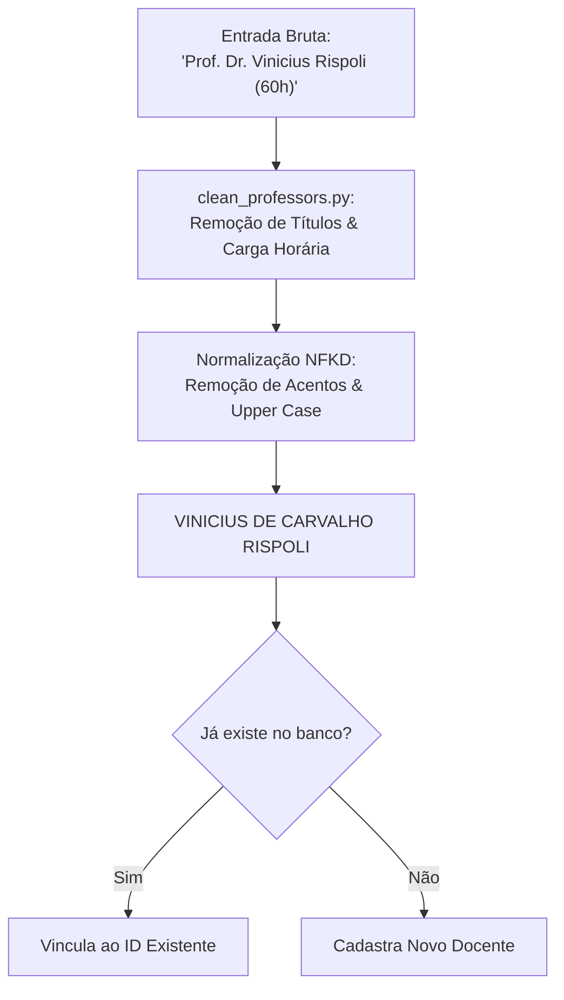

# Contratos de Dados & Resolução de Entidades

No **UnBook 2.0**, a integridade e interoperabilidade entre a esteira de engenharia de dados (`unbook-data-pipeline`) e a aplicação monorepo (`unbook-2`) é garantida por **contratos de dados tipados** e um rigoroso pipeline de **Entity Resolution (Resolução de Entidades)**.

---

## Contratos de Extração (Pydantic / Dataclasses)

Todas as entidades extraídas do SIGAA, das redes sociais ou da base legada são validadas contra schemas estritos antes da persistência:

### 1. Contrato de Docente (`ProfinfoItem`)
```python
from dataclasses import dataclass
from typing import Optional

@dataclass
class ProfinfoItem:
    nome: str
    departamento: str
    siape: Optional[str] = None
    gabinete: Optional[str] = None
    lattes: Optional[str] = None
    email: Optional[str] = None
    foto_url: Optional[str] = None
```

### 2. Contrato de Turma Ofertada (`TurmaItem`)
```python
from dataclasses import dataclass

@dataclass
class TurmaItem:
    course_code: str        # Ex: "CIC0004"
    course_name: str        # Ex: "ALGORITMOS E PROGRAMAÇÃO DE COMPUTADORES"
    class_code: str         # Ex: "01", "A"
    schedules_raw: str      # Ex: "24M12", "35T34"
    location: str           # Ex: "PAT AT 01/10"
    vacancies: int          # Vagas totais
    docente: str            # Nome bruto do professor
    departamento: str       # Sigla/nome do departamento
```

### 3. Contrato de Avaliação Sanitizada (`ReviewContract`)
```python
from pydantic import BaseModel, Field
from typing import Literal

class ReviewContract(BaseModel):
    course_code: str
    professor_name: str
    status_aprovacao: Literal["Passei", "Reprovei", "Tranquei"]
    vibe_categoria: Literal["Sono", "Explosao_Mental", "Tranquilo", "Revolta", "Desafiador"]
    chamada_obrigatoria: bool
    prova_substitutiva: bool
    monitoria_ativa: bool
    cobranca_justa: bool
    comentario: str = Field(min_length=20, max_length=2000)
    hash_anonimo: str
```

---

## Pipeline de Resolução de Entidades (Entity Resolution)

O SIGAA frequentemente apresenta variações de digitação, títulos acadêmicos mesclados ao nome do professor ou cargas horárias embutidas. Os módulos em `src/transformers/` realizam a higienização:



### 1. Limpeza de Docentes (`clean_professors.py`)
- **Remoção de Títulos:** Elimina prefixos como `"PROF."`, `"DRA."`, `"PHD"`, `"ME."`.
- **Expurgo de Carga Horária Embutida:** Remove sufixos como `"(60H)"` ou `"(30H)"` comuns nas tabelas de turma do SIGAA via regex `r'\s*\(\d+H\)'`.
- **Padronização Tipográfica:** Converte texto para caixa alta sem acentos (usando decomposição NFKD).

### 2. Separação de Código e Nome de Disciplina (`clean_courses.py`)
- O SIGAA exporta cadeias combinadas como `"MAT0025 - CÁLCULO 1"`.
- O parser separa o código formal alfanumérico (`MAT0025`) do nome descritivo (`CÁLCULO 1`), garantindo integridade referencial nas chaves primárias.

### 3. Filtro de Ruído em Comentários
- Descarta textos contendo apenas caracteres de pontuação ou expressões nulas (`"."`, `"..."`, `"ok"`, `"tr"`, `"n/a"`, `"teste"`).
- Aplica regex para mascaramento de matrículas discentes da UnB (`\b[12][0-9]{7,8}\b`).

---

## Contrato Estruturado com a Google Gemini API

Para a sumarização da **Análise UnBook**, o modelo LLM é restringido a gerar respostas JSON estritas correspondentes ao schema Pydantic:

```python
from pydantic import BaseModel, Field

class AnaliseUnBookSummary(BaseModel):
    resumo_executivo: str = Field(description="Síntese da disciplina em até 3 frases.")
    metodologia_provas: str = Field(description="Critérios e previsibilidade das provas.")
    pontos_fortes: list[str] = Field(description="Destaques positivos da matéria.")
    pontos_atencao: list[str] = Field(description="Aspectos críticos a considerar.")
    badges: list[str] = Field(description="Badges aplicáveis (ex: PADGE: SONO, PADGE: PAU PURO).")
```
