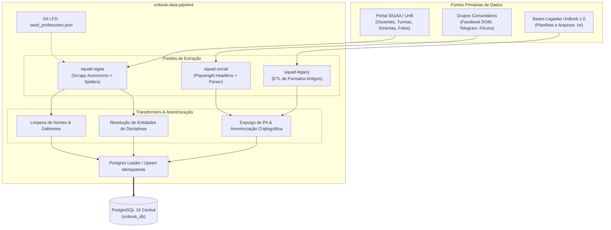

# Esteira de Ingestão & Integração Externa (`unbook-data-pipeline`)

O repositório **`unbook-data-pipeline`** é a espinha dorsal de dados do ecossistema **UnBook 2.0**, gerenciado pelo time de **Engenharia de Dados (`@unbook-org/data-engineers`)**.

Sua missão é automatizar a captura contínua, limpeza, resolução de entidades e anonimização dos dados acadêmicos e comunitários da Universidade de Brasília.

---

## Topologia da Esteira de Dados



---

## As Três Frentes de Extração

### 1. Frente SIGAA (`squad-sigaa`)
- **Tecnologia:** **Scrapy** (rastreamento assíncrono em alta escala) e scripts de seed.
- **Arquivo Semente (`seed_professores.json`):** Mapeamento prévio dos links de departamentos e páginas públicas de docentes da UnB, rastreado via **Git LFS** para manter o repositório leve.
- **Dados Minerados:**
  - Nome completo e matrícula SIAPE do docente;
  - Lotação (Instituto/Departamento e Campus);
  - Gabinete físico e e-mail institucional;
  - Oferta histórica de turmas (com código de horários brutos como `24M12`);
  - Ementa curricular e créditos oficiais.

### 2. Frente Social (`squad-social`)
- **Tecnologia:** **Playwright** executando em modo headless para navegação e captura estruturada de DOM.
- **Finalidade:** Capturar relatos espontâneos e feedbacks contextuais deixados pela comunidade discente em grupos acadêmicos e fóruns.
- **Higienização em Tempo Real:** Todo texto capturado passa imediatamente pelo módulo de anonimização e expurgo de dados pessoais (PII) antes de qualquer persistência em disco.

### 3. Frente Legada (`squad-legacy`)
- **Tecnologia:** Scripts em Python com **Pandas** e expressões regulares.
- **Finalidade:** Resgatar as milhares de avaliações coletadas na versão original (1.0) do UnBook a partir de dumps de formulários, unificando códigos antigos com a taxonomia do novo banco relacional.

---

## Orquestração via CLI Central (`main.py`)

A esteira de dados é orquestrada por uma interface de linha de comando centralizada (`main.py`):

```bash
# Execução da frente SIGAA em modo de teste (primeiros 10 professores)
python main.py --source sigaa --limit 10

# Execução completa da esteira SIGAA (todos os departamentos da UnB)
python main.py --source sigaa

# Processamento e higienização do dump comunitário social
python main.py --source social

# Forçar nova captura web via Playwright + Limpeza
python main.py --source social --scrape-facebook

# Processamento da base legada (Google Forms CSV)
python main.py --source legacy

# Execução completa sequencial (SIGAA + Social + Legacy)
python main.py --source all
```

---

## Carga no Banco (Upsert Idempotente)

O módulo `src/loaders/postgres_loader.py` recebe os registros estruturados e executa operações de **Upsert (ON CONFLICT DO UPDATE)**:
- Evita registros duplicados de professores e turmas;
- Preserva estatísticas já consolidadas no banco de produção;
- Atualiza horários e locais caso o departamento modifique as salas no SIGAA antes do início das aulas.
