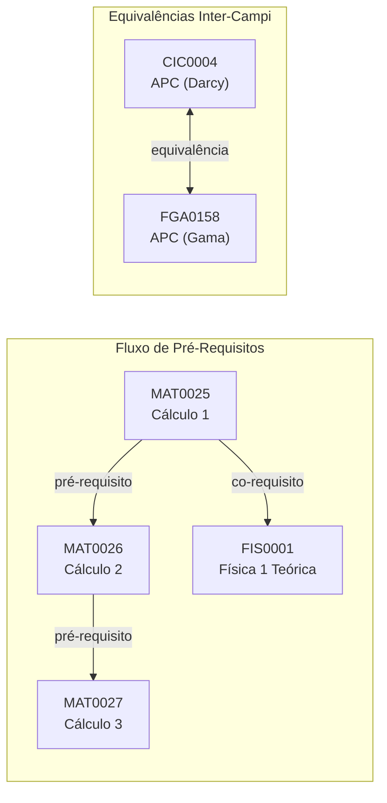
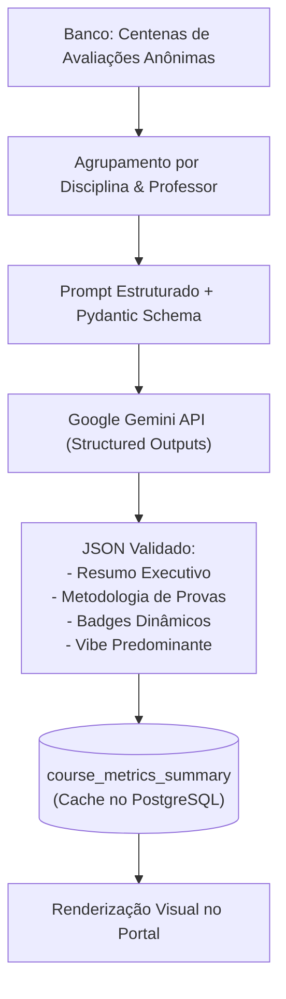

# Catálogo, Ementas & Análise UnBook (`services/catalog`)

O **`services/catalog`** é o serviço responsável pela modelagem do conhecimento curricular e inteligência pedagógica do **UnBook 2.0**, mantido pela **Squad Catalog (`@unbook-org/squad-catalog`)**.

---

## Visão Geral & Responsabilidades

O serviço centraliza toda a lógica de cursos, disciplinas, ementas e dependências acadêmicas da UnB, além de orquestrar a geração da **"Análise UnBook"** via inteligência artificial:

1. **Guia Curricular & Ementas:** Exposição detalhada dos programas de ensino, cargas horárias, créditos e departamentos de cada matéria da UnB.
2. **Grafos de Dependência Curricular:** Navegação pelas árvores de pré-requisitos, co-requisitos e equivalências registradas na tabela canônica `TB_RELACAO_MATERIA`.
3. **Listas Personalizadas do Estudante (`/catalog/mylist`):** Permite ao aluno marcar matérias cursadas, pendentes ou de interesse para o próximo semestre, alimentando recomendações personalizadas.
4. **Síntese Inteligente (Análise UnBook):** Geração de resumos executivos objetivos a partir de múltiplos relatos e avaliações anônimas utilizando a **Google Gemini API**.

---

## Stack Tecnológica

| Camada | Tecnologia | Justificativa Técnica |
| :--- | :--- | :--- |
| **Framework API** | **Django 5 + Django Ninja (Python 3.12)** | Rotas assíncronas de alta performance, validação nativa via Pydantic v2 e documentação Swagger automática. |
| **Banco & ORM** | **PostgreSQL 16 + Django ORM** | Modelagem declarativa do grafo curricular (`TB_RELACAO_MATERIA`), migrações robustas e suporte a `pgvector`. |
| **Moderação & Gestão**| **Django Admin** | Interface pronta para auditoria e moderação de avaliações anônimas e retificações curriculares. |
| **Inteligência Artificial** | **Google Gemini API (via Instructor & LiteLLM)** | Sumarização avançada de avaliações com garantia estrita de formato JSON (*Structured Outputs*). |

---

## Grafo de Dependências (`TB_RELACAO_MATERIA`)

O `services/catalog` processa as relações curriculares da UnB modeladas como um grafo direcionado:



### Tipos de Relações Curriculares:
- **`pre_requisito`:** Disciplinas cujo trancamento ou reprovação impede a matrícula na matéria-alvo.
- **`co_requisito`:** Disciplinas que devem ser cursadas obrigatoriamente no mesmo semestre letivo.
- **`equivalencia`:** Disciplinas que cumprem a mesma exigência curricular entre departamentos ou campi distintos (ex: Darcy vs FGA).

---

## Análise UnBook via Google Gemini API

Para poupar os estudantes da leitura de dezenas de comentários manuais repetitivos, o `services/catalog` executa um pipeline de sumarização utilizando o modelo **Google Gemini** com biblioteca **Instructor**:



### Contrato de Saída do Gemini (Schema Pydantic):
```python
from pydantic import BaseModel, Field

class AnaliseUnBookSummary(BaseModel):
    resumo_executivo: str = Field(description="Síntese neutra e objetiva de até 3 frases sobre a condução da disciplina.")
    estilo_didatico: str = Field(description="Principais características da didática do professor.")
    metodologia_provas: str = Field(description="Como as avaliações são cobradas (teóricas, práticas, coerência).")
    pontos_fortes: list[str] = Field(description="Até 3 aspectos positivos destacados pelos alunos.")
    pontos_atencao: list[str] = Field(description="Até 3 pontos de atenção pedagógicos.")
    badges: list[str] = Field(description="Lista de badges atribuídos, ex: 'PADGE: SONO', 'PADGE: PROVA JUSTA'.")
```

---

## Lista Personalizada do Aluno (`/catalog/mylist`)

O endpoint `/catalog/mylist` armazena o planejamento pessoal de longo prazo do estudante:
- **Disciplinas Cursadas:** Matérias já concluídas, permitindo que a API valide se o estudante cumpriu todos os pré-requisitos para turmas futuras.
- **Disciplinas de Interesse:** Matérias salvas para simulação rápida no **UnBPlanner**.
- **Calculadora de Integralização:** Total de créditos acumulados vs. total de créditos exigidos pelo projeto pedagógico do curso (PPC).

---

## Execução Local

```bash
cd services/catalog

python -m venv venv
source venv/bin/activate
pip install -r requirements.txt

# Executa migrações do banco de dados
python manage.py migrate

# Inicia a API com recarregamento automático (ou via ASGI: uvicorn config.asgi:application --port 8002 --reload)
python manage.py runserver 8002
```
