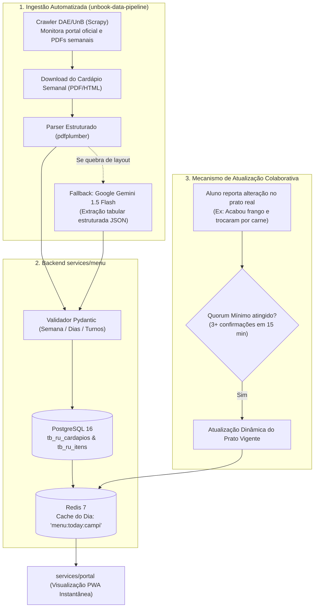
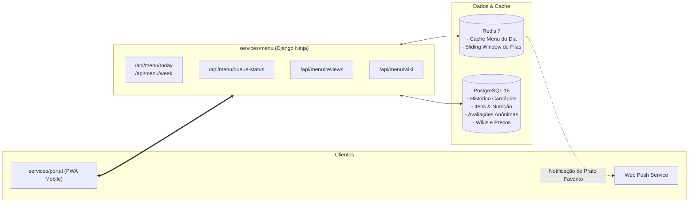
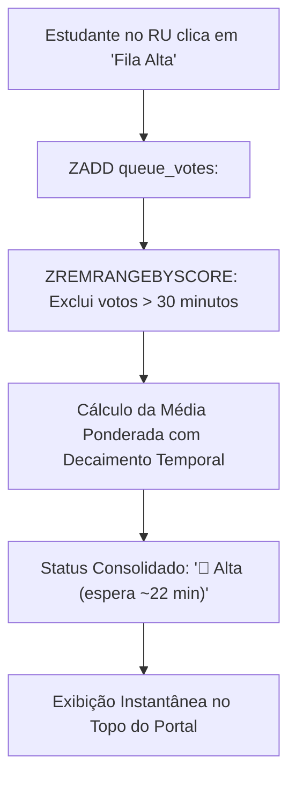
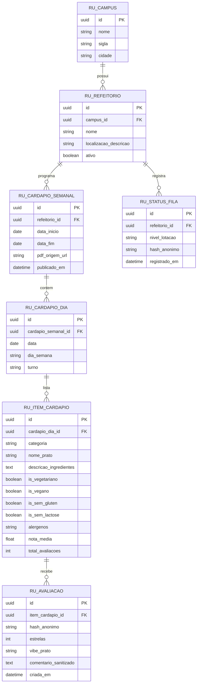

# Menu do RU & Restaurante Universitário (`services/menu`)

O **`services/menu`** é o microsserviço responsável pela gestão, agregação, inteligência e monitoramento comunitário do **Restaurante Universitário (RU)** dos campi da Universidade de Brasília no ecossistema **UnBook 2.0**, mantido pelo **Squad Menu (`@unbook-org/squad-menu`)**.

---

## Visão Geral & Responsabilidades

O Restaurante Universitário da UnB é o coração da convivência e da permanência estudantil na universidade, servindo diariamente mais de **10.000 refeições** divididas entre os quatro campi (Darcy Ribeiro, FGA/Gama, FCE/Ceilândia e FAL/Planaltina). 

Historicamente, os estudantes enfrentavam dificuldades para acessar informações atualizadas do cardápio (frequentemente dispersas em arquivos PDF ou publicações estáticas do Decanato de Assuntos Comunitários — DAC/DAE), além de lidarem com alterações de última hora nos pratos, filas imprevisíveis e dúvidas recorrentes sobre métodos de pagamento e recarga.

O `services/menu` resolve essas dores centralizando e transformando o RU em uma experiência integrada, colaborativa e em tempo real:

1. **Cardápio Inteligente Multi-campi:** Disponibilização diária e semanal estruturada dos cardápios de todos os refeitórios da UnB (Almoço, Jantar e Desjejum para residentes), com filtros avançados para restrições alimentares (vegetariano, vegano, sem glúten, sem lactose e alertas de alérgenos).
2. **Termômetro de Fila & Horários de Pico:** Monitoramento em tempo real do tempo de espera nas filas por meio de modelo preditivo híbrido (cruzamento com a grade horária de turmas do `services/planner`) e confirmações rápidas via crowdsourcing em 1 clique.
3. **Avaliação Express & Ranking Gastronômico:** Sistema de avaliações anônimas de pratos (Vibe do Prato e notas objetivas), consolidando o ranking dos pratos mais aclamados e mais temidos da história da UnB.
4. **Alertas & Notificações de Pratos Favoritos:** Notificações push via PWA alertando o estudante quando seu prato predileto (ex: Feijoada Universitária, Strogonoff ou Feijoada Vegana) for servido no campus de interesse.
5. **Central de Apoio & RU-Wiki:** Guia completo e atualizado com tabela de preços por faixa de subsídio (PNAES / vulnerabilidade socioeconômica, graduação, pós, servidores e comunidade externa), horários de funcionamento das catracas, passo a passo de emissão de GRU/PIX e regras de acesso com a carteirinha estudantil física ou digital.

---

## Análise de Valor & Sinergia com o UnBook 2.0

A incorporação do `services/menu` é estratégica para o ecossistema do UnBook 2.0 pelos seguintes fatores:

| Dimensão Estratégica | Benefício para o Ecossistema UnBook |
| :--- | :--- |
| **Combate à Sazonalidade (Hiper-aumento de DAU)** | O uso do UnBook acadêmico tradicional concentra-se em picos semestrais (matrícula, ajuste e término de semestre). O cardápio do RU atrai os estudantes **todos os dias úteis** entre 11h e 13h30 e entre 17h e 19h30, elevando o Daily Active Users (DAU) e a retenção do aplicativo instalado (PWA). |
| **Sinergia com o Planner (`services/planner`)** | Cruzando o local onde o estudante tem aula (ex: encerramento no ICC Sul às 11h50) com o cardápio e a previsão de pico das filas, o app pode sugerir janelas ideais de almoço antes da próxima disciplina. |
| **Sinergia com a Busca Global (`services/search`)** | Permite pesquisar no Hero Search por termos gastronômicos e nutricionais (*"feijoada"*, *"opção vegana"*, *"strogonoff"*, *"cardápio hoje"*) com resposta imediata sub-15ms. |
| **Engajamento Comunitário & Anonimato** | Aproveita a infraestrutura de credenciais do UnBook (autenticação institucional anônima) para permitir avaliações de refeições e reportes de fila legítimos, prevenindo spam e bots sem comprometer a identidade do aluno. |

---

## Stack Tecnológica

| Camada | Tecnologia Adotada | Justificativa Técnica |
| :--- | :--- | :--- |
| **Framework API** | **Django 5 + Django Ninja (Python 3.12)** | Rotas assíncronas (`async def`) para absorver picos de tráfego simultâneos nos horários de almoço/jantar, validação estrita via Pydantic v2 e curadoria via Django Admin. |
| **Banco Relacional & ORM** | **PostgreSQL 16 + Django ORM** | Armazenamento seguro e estruturado de cardápios históricos, catálogo de pratos/ingredientes, valores nutricionais e avaliações anônimas. |
| **Cache & Real-Time** | **Redis 7** | Cache in-memory do cardápio do dia (latência sub-5ms), armazenamento de contadores voláteis e agregação com TTL (Time-To-Live) de 30 minutos para os reportes de tamanho de fila. |
| **Ingestão & Parsing** | **pdfplumber + Google Gemini API** | Extração estruturada de tabelas dos editais/boletins em PDF disponibilizados semanalmente pelo DAE/UnB, com fallback inteligente para IA em caso de mudanças de diagramação. |

---

## Topologia de Ingestão de Dados do Cardápio

A alimentação dos dados do cardápio ocorre de maneira híbrida e resiliente para garantir que os estudantes nunca fiquem sem informação:



---

## Arquitetura do Serviço



---

## Funcionalidades em Detalhe

### 1. Cardápio Semanal & Diário Multi-campi
O serviço organiza os cardápios em uma taxonomia padronizada para cada campus e unidade de refeição:
- **Campi Suportados:**
  - Darcy Ribeiro (Unidade Darcy Central e Unidade Darcy Norte);
  - Campus Gama (FGA);
  - Campus Ceilândia (FCE);
  - Campus Planaltina (FAL).
- **Turnos de Atendimento:**
  - **Desjejum:** Café da manhã exclusivo para estudantes residentes da CEU (Casa do Estudante Universitário) e bolsistas autorizados.
  - **Almoço:** Turno diurno com grande variedade de acompanhamentos e prato proteico principal.
  - **Jantar:** Turno noturno adaptado com refeição completa ou sopa/lanche reforçado.
- **Divisão das Preparações:**
  - **Prato Principal:** Proteína animal regular (ex: Frango grelhado, carne de panela, feijoada tradicional, peixe assado);
  - **Opção Vegetariana/Vegana:** Proteína vegetal equivalente (ex: Moqueca de grão de bico, proteína de soja ao curry, hambúrguer de lentilha);
  - **Guarnição:** Complemento quente (ex: Farofa rica, purê de mandioca, macarrão alho e óleo, legumes salteados);
  - **Acompanhamentos Básicos:** Arroz branco, arroz integral e feijão (carioca/preto);
  - **Salada:** Variedade crua e cozida (folhas, legumes ralados, vinagrete);
  - **Sobremesa:** Fruta da estação ou doce institucional;
  - **Bebida:** Suco natural ou polpa pasteurizada.
- **Filtros Nutricionais e Alérgenos:** Indicadores visuais de fácil identificação:
  - `[VEG]` Vegano / Vegetariano
  - `[SEM LACTOSE]` Isento de derivados de leite
  - `[SEM GLÚTEN]` Não contém trigo, cevada ou aveia
  - `[ALÉRGICO]` Alerta para presença de amendoim, ovos, nozes ou peixes

---

### 2. Termômetro de Lotação & Horários de Pico

Para evitar que o estudante enfrente filas que dobram o bloco sem necessidade, o `services/menu` utiliza uma abordagem em dois níveis:

#### A. Previsão Heurística Baseada na Grade de Turmas
O serviço analisa a distribuição horária das turmas da UnB registradas no `services/planner`. Sabendo que horários como **11h50**, **12h50**, **17h50** e **19h50** coincidem com o término maciço de aulas no ICC e demais pavilhões, o sistema prevê curvas de afluência esperadas para as catracas.

#### B. Crowdsourcing Colaborativo (Sliding Window de 30 minutos)
No frontend PWA do portal, o aluno pode informar com um toque o estado real da fila:
- 🟢 **Fila Baixa:** Atendimento rápido (< 5 minutos);
- 🟡 **Fila Média:** Fluxo contínuo dentro do refeitório (5 a 15 minutos);
- 🔴 **Fila Alta / Dobrando o Prédio:** Fila ultrapassando a área coberta (> 20 minutos).

Os votos são agregados em uma janela móvel no **Redis 7** com decaimento exponencial, descartando automaticamente reportes com mais de 30 minutos de antiguidade.



---

### 3. Avaliação Express & Ranking Gastronômico

Seguindo a mesma identidade de simplicidade do Wizard de Avaliação do UnBook, o estudante avalia a refeição do dia de forma objetiva e sem atrito:

- **Passo 1 (Desfecho):** Almocei / Jantei hoje;
- **Passo 2 (Avaliação do Prato Principal):** ⭐ 1 a 5 estrelas;
- **Passo 3 (Vibe da Refeição):** Seleção de tags diretas:
  - `[Top Demais]` — Refeição saborosa, quente e bem temperada;
  - `[Comestível]` — Dentro dos padrões normais de sobrevivência universitária;
  - `[Seco / Queimado]` — Proteína passada do ponto;
  - `[Sem Tempero]` — Falta de sal/tempero geral;
  - `[Faltou Comida]` — Acabou a proteína principal ou guarnição antes do fechamento.
- **Passo 4 (Comentário Curto Sanitizado):** Higienizado automaticamente contra PII (informações pessoais de funcionários do refeitório) e termos abusivos.

#### Hall da Fama e Ranking Semestral
O serviço consolida rankings públicos permanentes:
- **Top 5 Refeições mais Aclamadas da UnB:** (ex: Feijoada Universitária Completa, Strogonoff de Frango com Batata Palha, Feijoada Vegana com Tofu Defumado);
- **Pratos mais Polêmicos / Temidos:** Pratos com menor aderência histórica (auxiliando o próprio DAC e a comissão de fiscalização de alimentação da universidade a propor melhorias nos contratos de fornecimento).

---

### 4. Alertas & Push Notifications PWA

O aluno pode favoritar pratos ou ingredientes específicos na sua lista de preferências no portal:
- Quando o robô de extração processar a publicação do cardápio semanal e identificar correspondência, o `services/menu` enfileira um gatilho de notificação:
- **Alerta Matinal (10h30):** *"Hoje tem Feijoada Universitária no RU Darcy Central e na FGA! Prepare-se para a fila."*
- **Alerta de Restrição:** Alunos veganos ou celíacos recebem aviso caso a opção do dia possua ingredientes substitutos de alta avaliação.

---

### 5. Central de Apoio & RU-Wiki

O `services/menu` atua como a base de conhecimento oficial e de consulta rápida para desmistificar o funcionamento do restaurante universitário para calouros e veteranos:

#### Tabela de Preços e Subsídios
| Categoria de Usuário | Condição / Requisito | Valor Almoço/Jantar | Valor Desjejum |
| :--- | :--- | :--- | :--- |
| **Estudante Nível 1 (PNAES)** | Alunos com vulnerabilidade socioeconômica assistidos pela DAC | **Gratuito** | **Gratuito** |
| **Estudante Graduação / Pós** | Matrícula ativa regular em disciplinas presenciais da UnB | **R$ 6,10** *(valor subsidiado)* | R$ 3,00 *(quando elegível)* |
| **Servidores Técnicos & Docentes** | Vínculo funcional ativo com a FUB/UnB | **R$ 13,00** *(tarifa técnica)* | N/A |
| **Comunidade Externa / Visitantes** | Participantes de eventos, congressistas ou visitantes | **R$ 15,50** *(custo integral)* | N/A |

#### Guia Prático de Pagamento & Recarga
1. **PIX Instantâneo no Guichê:** Pagamento via QR Code dinâmico diretamente nos totens ou guichês de atendimento das catracas.
2. **Guia de Recolhimento da União (GRU):** Geração no sistema SIGAA/Portal da UnB e pagamento exclusivo no Banco do Brasil para recarga de lotes de créditos na carteirinha física.
3. **Cartão de Débito:** Aceito nos guichês presenciais de recarga.
4. **Validação de Entrada:** Apresentação da Carteirinha Estudantil física com chip RFID ou Carteirinha Digital via aplicativo oficial da UnB acompanhada de documento oficial com foto.

---

## Modelagem de Dados Relacional (PostgreSQL)

O esquema relacional é estruturado para suportar escalabilidade, histórico semestral e auditoria com preservação do anonimato:



---

## Contratos da API REST (Schemas Pydantic)

### 1. Obtenção do Cardápio do Dia
```http
GET /api/menu/today?campus=darcy&refeitorio=central&turno=almoco
```

#### Resposta JSON:
```json
{
  "campus": "Darcy Ribeiro",
  "refeitorio": "Restaurante Universitário Central",
  "data": "2026-09-16",
  "dia_semana": "Quarta-feira",
  "turno": "almoco",
  "status_fila": {
    "nivel": "moderada",
    "tempo_estimado_minutos": 12,
    "ultima_atualizacao": "2026-09-16T12:05:00Z",
    "total_reportes_ativos": 18
  },
  "refeicao": {
    "prato_principal": {
      "id": "c7a8e234-9812-4211-9a1b-123456789abc",
      "nome": "Iscas de Frango com Pimentões e Cebola",
      "alergenos": ["Nenhum"],
      "nota_media": 4.3,
      "total_avaliacoes": 87
    },
    "opcao_vegetariana": {
      "id": "e8b9f345-1234-4322-8b2c-987654321def",
      "nome": "Moqueca Vegana de Grão de Bico com Leite de Coco",
      "is_vegano": true,
      "alergenos": ["Soja"],
      "nota_media": 4.7,
      "total_avaliacoes": 54
    },
    "guarnicao": "Farofa Crocante de Milho",
    "acompanhamentos": ["Arroz Branco", "Arroz Integral Orgânico", "Feijão Carioca"],
    "saladas": ["Alface Crespa", "Vinagrete Especial com Coentro"],
    "sobremesa": "Laranja Pera ou Banana Prata",
    "suco": "Suco Natural de Manga"
  }
}
```

### 2. Reporte Comunitário de Fila
```http
POST /api/menu/queue-status
Content-Type: application/json
Authorization: Bearer <token_anonimo_estudante>

{
  "refeitorio_id": "b3e94411-9251-4091-a672-47520e189871",
  "nivel": "alta",
  "observacao": "Fila dobrando o gramado perto do ICC Sul"
}
```

### 3. Avaliação Express do Prato
```http
POST /api/menu/reviews
Content-Type: application/json
Authorization: Bearer <token_anonimo_estudante>

{
  "item_cardapio_id": "c7a8e234-9812-4211-9a1b-123456789abc",
  "estrelas": 5,
  "vibe_prato": "Top Demais",
  "comentario": "Frango bem temperado e quentinho hoje!"
}
```

---

## Integração com os Demais Serviços

| Microsserviço | Ponto de Contato & Fluxo de Integração |
| :--- | :--- |
| **`services/portal`** | Renderização da aba dedicada `/menu` com cards responsivos, filtros de restrição dietética, botão flutuante de reporte de fila e modal de avaliação rápida. |
| **`services/search`** | Sincronização diária de novos pratos para indexação no Meilisearch, possibilitando autocompletar e busca tolerante a erros no Hero Search. |
| **`services/planner`** | Inclusão de slot visual *"Almoço no RU"* na grade horária semanal gerada, evitando marcação de disciplinas no horário do almoço e recomendando refeitórios próximos ao local das aulas da manhã. |
| **`unbook-data-pipeline`** | Spider agendado para rodar toda sexta-feira às 18h e segundas às 06h buscando o cardápio oficial publicado pelo DAC/UnB. |

---

## Execução Local do Serviço

```bash
# Acesse o diretório do serviço
cd services/menu

# Crie e ative o ambiente virtual
python -m venv venv
source venv/bin/activate

# Instale as dependências
pip install -r requirements.txt

# Execute as migrações do banco de dados
python manage.py migrate

# Inicie o microsserviço com recarregamento automático (ou via ASGI: uvicorn config.asgi:application --port 8004 --reload)
python manage.py runserver 8004
```
