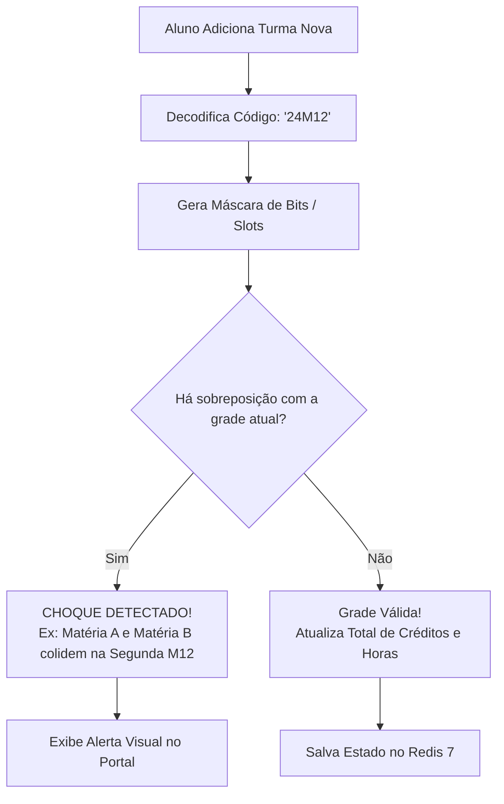

# Planner & Grade Horária (`services/planner`)

O **`services/planner`** é o motor de simulação e montagem de grade horária semanal do **UnBook 2.0**, mantido pela **Squad Planner (`@unbook-org/squad-planner`)**.

---

## Visão Geral & Responsabilidades

Durante os períodos de matrícula e ajuste de turmas da UnB, os estudantes enfrentam o desafio manual de combinar turmas de diferentes departamentos sem gerar conflitos de horário. O `services/planner` automatiza esse processo:

1. **Parser & Decodificador do SIGAA:** Converte códigos alfanuméricos compactos de horários (como `24M12` ou `35T34`) em matrizes temporais concretas de dias e horários.
2. **Validação Matricial de Conflitos:** Algoritmo que detecta choques de horários em tempo real entre turmas adicionadas à grade.
3. **Cálculo de Carga Semestral:** Contabilização de créditos totais e horas semanais, emitindo alertas caso o aluno ultrapasse os limites regimentais da UnB.
4. **Armazenamento Volátil de Rascunhos:** Manutenção da grade temporária no **Redis 7** para que o usuário não perca sua montagem ao atualizar a página.
5. **Exportação de Grade:** Geração instantânea de arquivos de calendário padrão (`.ics`) e imagens renderizadas prontas para compartilhamento.

---

## Stack Tecnológica

| Camada | Tecnologia | Justificativa Técnica |
| :--- | :--- | :--- |
| **Framework API** | **Django 5 + Django Ninja (Python 3.12)** | Schemas Pydantic v2 para validação de horários/turmas e OpenAPI Swagger para integração com o frontend. |
| **Validação Matricial** | **Numpy / Algoritmo Matricial** | Resolução bitwise e temporal de choques de horário em tempo real. |
| **Persistência Volátil** | **Redis 7** | Cache rápido de rascunhos de grade semestral e compartilhamento com TTL configurável. |
| **Banco Canônico** | **PostgreSQL 16 + Django ORM** | Catálogo oficial de turmas ofertadas pelo SIGAA. |

---

## Como Funcionam os Horários da UnB no SIGAA

A Universidade de Brasília adota uma notação padronizada no formato `[DIAS][TURNO][BLOCOS]`:

```text
  2 4 M 1 2
  │ │ │ └─┴── Horários 1 e 2 (08h00 às 09h50)
  │ │ └────── Turno: M (Manhã), T (Tarde) ou N (Noite)
  └─┴──────── Dias: 2 (Segunda), 3 (Terça), 4 (Quarta), 5 (Quinta), 6 (Sexta), 7 (Sábado)
```

### Grade de Horários Oficiais dos Campi:
| Turno | Código | Horário Real |
| :--- | :--- | :--- |
| **Manhã** | `M12` | 08h00 – 09h50 |
| | `M34` | 10h00 – 11h50 |
| | `M5` | 12h00 – 12h50 |
| **Tarde** | `T12` | 14h00 – 15h50 |
| | `T34` | 16h00 – 17h50 |
| | `T56` | 18h00 – 19h50 |
| **Noite** | `N12` | 19h00 – 20h40 / 20h50 – 22h30 |

---

## Algoritmo Matricial de Detecção de Choques

O validador matricial do `services/planner` mapeia cada semana letiva em uma matriz booleana de 6 colunas (Segunda a Sábado) por 15 blocos horários:



### Exemplo de Conflito Matricial:
- **Turma 1 (Cálculo 1):** `24M12` (Segunda e Quarta das 08h às 10h);
- **Turma 2 (Física 1):** `26M12` (Segunda e Sexta das 08h às 10h);
- **Resultado do Algoritmo:** Conflito na **Segunda-feira no bloco M12**. O Planner sinaliza visualmente a colisão, impedindo a montagem incorreta.

---

## Exportação para Calendários (.ics) e Imagem

O serviço implementa utilitários para facilitar a rotina do aluno durante o semestre:

```http
POST /api/planner/export/ics
Content-Type: application/json

{
  "semester": "2026.1",
  "classes": ["turma-uuid-1", "turma-uuid-2"]
}
```

- **Arquivo `.ics` Compatível:** Cria eventos recorrentes com início no primeiro dia letivo da UnB, incluindo nome da matéria, professor e sala/prédio de aula (`local`).
- **Imagem de Alta Resolução:** Gera PNG da grade semanal formatada com cores distintas por matéria, pronta para salvar no celular ou enviar em grupos de estudo.

---

## Execução Local

```bash
cd services/planner

python -m venv venv
source venv/bin/activate
pip install -r requirements.txt

# Inicie a API do Planner (ou via ASGI: uvicorn config.asgi:application --port 8003 --reload)
python manage.py runserver 8003
```
