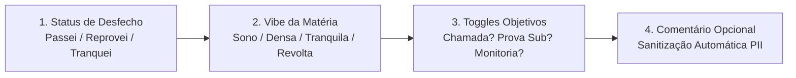

# Portal Web (`services/portal`)

O **`services/portal`** é a aplicação frontend principal do **UnBook 2.0**, mantida pela **Squad Portal (`@unbook-org/squad-portal`)**. Ele entrega uma experiência visual rápida, intuitiva e focada nas necessidades do estudante universitário da UnB.

---

## Visão Geral & Responsabilidades

Construído com base na arquitetura **Mobile-First** e adaptável para **PWA (Progressive Web App)**, o portal oferece:

1. **Hero Search Central:** Barra de pesquisa unificada com busca instantânea em menos de 15ms integrada diretamente ao `services/search`.
2. **Guia Curricular Interativo:** Visualização de ementas, árvores de pré-requisitos/co-requisitos e histórico de turmas da UnB (`services/catalog`).
3. **Simulador de Grade Semestral:** Interface arrastar-e-soltar ou clique rápido para montagem de grades semanais sem choques de horário (`services/planner`).
4. **Wizard de Avaliação Express:** Formulário dinâmico em etapas simples para registro anônimo de avaliações de disciplinas e docentes.
5. **Painel do Estudante (`/catalog/mylist`):** Espaço para o aluno salvar matérias de interesse, acompanhar requisitos concluídos e monitorar créditos acumulados.

---

## Stack Tecnológica

| Camada | Tecnologia | Justificativa |
| :--- | :--- | :--- |
| **Framework** | **Next.js (React 19)** | Server-Side Rendering (SSR) e geração estática para SEO em páginas de disciplinas e cursos; Client-Side Rendering (CSR) ágil no montador de grade. |
| **Estilização** | **Tailwind CSS** | Design responsivo, temas claro/escuro nativos e paleta harmonizada com a identidade visual da UnB. |
| **Estado Global** | **Zustand** | Gerenciamento de estado leve e de alta performance para a grade ativa do Planner e lista personalizada de matérias. |
| **Data Fetching** | **TanStack Query (React Query)** | Cache inteligente de requisições, invalidação automática e revalidação em segundo plano. |
| **Componentes Base** | **Radix UI** | Primitivos acessíveis de interface com suporte rigoroso às normas de acessibilidade (WAI-ARIA). |

---

## Interface & Experiência do Usuário (UX)

### 1. Wizard de Avaliação Express
O portal substitui questionários longos e cansativos por um fluxo de avaliação simplificado em 4 passos objetivos:



### 2. Badges Dinâmicos da "Análise UnBook"
No cabeçalho de cada matéria e professor, o portal renderiza badges gerados por IA e consolidados pelo backend:

- `[PADGE: SONO]` — Indicador de aulas com ritmo excessivamente teórico ou monótono;
- `[PADGE: NÃO TANKEI]` — Indicador de disciplinas com alto índice histórico de reprovação e cobrança rigorosa;
- `[PADGE: JUSTO]` — Alinhamento comprovado entre o conteúdo lecionado em aula e as avaliações aplicadas.

---

## Suporte a PWA & Mobile-First

O portal é totalmente otimizado para celulares e tablets:
- **Instalação na Tela Inicial:** Pode ser instalado como aplicativo nativo via manifest PWA.
- **Funcionamento Offline Parcial:** Consulta a ementas e horários salvos na grade mesmo sem conexão com a internet através do cache local (Service Workers e LocalStorage via Zustand).
- **Gestos Touch:** Navegação fluida por abas de dias da semana na visualização mobile da grade horária do Planner.

---

## Execução Local

```bash
# Navegue até o diretório do serviço
cd services/portal

# Instale as dependências
npm install # ou pnpm install

# Configure as variáveis de ambiente
cp .env.example .env.local

# Inicie o servidor de desenvolvimento
npm run dev
# Disponível em http://localhost:3000
```
