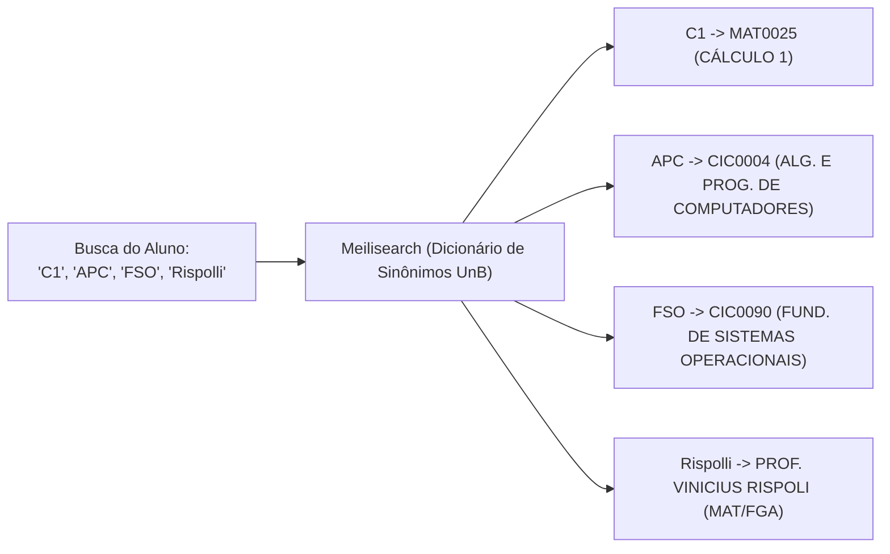

# Motor de Busca & Hero Search (`services/search`)

O **`services/search`** é o serviço de busca de alta velocidade do **UnBook 2.0**, mantido pela **Squad Search (`@unbook-org/squad-search`)**. Ele é o motor que alimenta a **Hero Search** (barra de busca central) e responde a consultas com latência ultra-baixa (**< 15ms**).

---

## Visão Geral & Responsabilidades

O principal desafio da busca acadêmica na UnB é que os estudantes raramente utilizam o código formal do SIGAA (como `MAT0025`) ou o nome completo oficial (como *"ALGORITMOS E PROGRAMAÇÃO DE COMPUTADORES"*). Na rotina universitária, busca-se por **siglas, apelidos e sobrenomes de professores**.

### Principais Capacidades:
1. **Consultas Instantâneas:** Resposta em tempo real enquanto o usuário digita (Search-as-you-type), otimizada para requisições com debounce de 150ms.
2. **Tolerância Severa a Erros de Digitação (Typo Tolerance):** Capacidade de aproximar palavras mesmo com trocas de letras, ausência de acentos ou digitação rápida em teclados mobile.
3. **Mapeamento de Apelidos & Jargão da UnB:** Dicionário dinâmico de sinônimos que converte expressões populares nos registros canônicos do banco de dados.

---

## Stack Tecnológica

| Componente | Tecnologia | Justificativa Técnica |
| :--- | :--- | :--- |
| **Framework API** | **Django 5 + Django Ninja (Python 3.12)** | Performance assíncrona (`async def`) para consultas I/O bound ao Meilisearch, documentação OpenAPI nativa e tipagem estrita com Pydantic v2. |
| **Motor de Indexação** | **Meilisearch** | Busca textual in-memory em C++ com suporte a prefix matching, ranking configurável e latência média inferior a 15ms. |
| **Sincronização** | **Background Tasks / CDC** | Consumo periódico ou orientado a eventos do PostgreSQL para atualizar documentos e novas turmas ofertadas. |

---

## Dicionário de Apelidos e Siglas da UnB

O Meilisearch é configurado com uma lista de sinônimos customizados para a realidade dos cursos e campi da UnB:



### Exemplos Mapeados no Sistema:
| Termo Digitado | Código SIGAA | Nome Canônico da Entidade |
| :--- | :--- | :--- |
| `c1`, `calc 1`, `calculo 1` | `MAT0025` | CÁLCULO 1 |
| `apc`, `prog computadores` | `CIC0004` | ALGORITMOS E PROGRAMAÇÃO DE COMPUTADORES |
| `fso`, `sistemas operacionais` | `CIC0090` | FUNDAMENTOS DE SISTEMAS OPERACIONAIS |
| `ed`, `eda`, `estruturas` | `CIC0097` | ESTRUTURAS DE DADOS |
| `fmc`, `fundamentos mat` | `MAT0031` | FUNDAMENTOS MATEMÁTICOS PARA COMPUTAÇÃO |
| `ted`, `tecnicas digitais` | `ENE0013` | TÉCNICAS DIGITAIS |
| `pe`, `probabilidade` | `EST0023` | PROBABILIDADE E ESTATÍSTICA |
| `rispolli`, `rispoli` | SIAPE Docente | VINICIUS DE CARVALHO RISPOLI (MAT/FGA) |

---

## Formato da Resposta da API

O serviço expõe endpoints REST otimizados para consumo direto pelo frontend Next.js:

```http
GET /api/search?q=c1&limit=5
```

```json
{
  "query": "c1",
  "processing_time_ms": 7,
  "hits": [
    {
      "id": "c92842c1-3f18-47c1-8419-482dfa299101",
      "type": "course",
      "code": "MAT0025",
      "name": "CÁLCULO 1",
      "department": "MAT",
      "campus": "Darcy Ribeiro",
      "credits": 6,
      "vibe_predominante": "Explosão Mental",
      "badges": ["PADGE: PAU PURO"]
    },
    {
      "id": "7fa1284d-2a18-4b21-9922-8321049281a2",
      "type": "professor",
      "name": "VINICIUS DE CARVALHO RISPOLI",
      "department": "MAT",
      "campus": "Gama",
      "taxa_recomendacao": 94.2
    }
  ]
}
```

---

## Execução Local

```bash
# Navegue até o serviço
cd services/search

# Crie e ative o ambiente virtual
python -m venv venv
source venv/bin/activate

# Instale as dependências
pip install -r requirements.txt

# Inicie a API com hot-reload (ou via ASGI: uvicorn config.asgi:application --port 8001 --reload)
python manage.py runserver 8001
```
